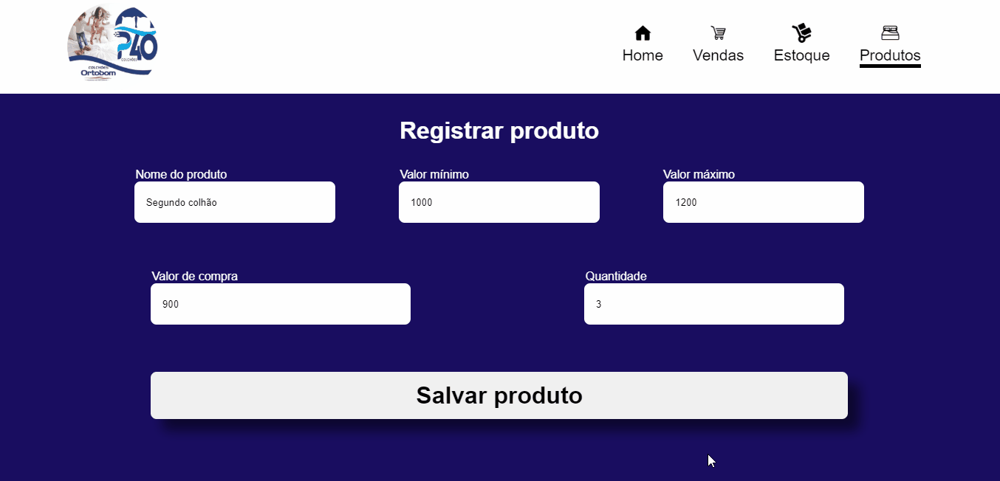

<h1 align="center">

</h1>

<h1>

</h1>

## 📝 Sobre:

O projeto consiste na construção de um sistema desktop para o PFC - projeto final de curso do SENAI, o qual permite o gerenciamento dos produtos, das vendas e do estoque da loja. 

---

## 🚀 Tecnologias utilizadas

O projeto foi desenvolvido utilizando as seguintes tecnologias:

- HTML
- CSS
- JavaScript
- [ElectronJs](https://www.electronjs.org/)
- [Mysql](https://www.mysql.com/)

---

## ⚠ Observações:

- O projeto é composto por um banco de dados.
- Caminho para acesso à estrutura.
- src --> db --> sql.js.

---

Desenvolvido por Marianna Lemos 💛.